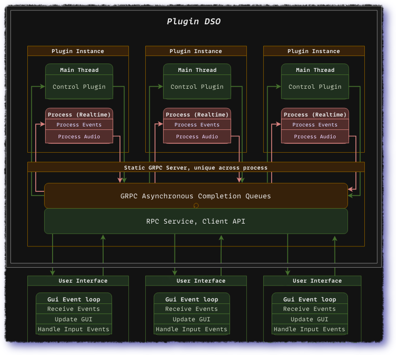

# clap-rci

> ⚠️ **Development Notice** ⚠️: This project is currently under heavy construction
> and is not ready yet. The API will undergo changes without prior notice. We mean it.

The **Remote Control Interface (RCI)** is a plugin layer abstraction for the
[*CLAP*](https://github.com/free-audio/clap) standard. It utilizes a
high-performance gRPC server to allow clients to connect and communicate with
hosted plugins. This communication is facilitated through protobuf and its
language-agnostic
[IDL](https://en.wikipedia.org/wiki/Interface_description_language). As a
result, clients can be implemented in any programming language that supports
gRPC by adhering to the defined [API](api/v0/api.proto).

|                           |   **Supported Languages** |                                                               |
|---------------------------|------------------------------------------------|---------------------------------------------------------------|
| 🛠️ [C++](https://grpc.io/docs/languages/cpp/)        | ☕ [Java](https://grpc.io/docs/languages/java/) | 🌐 [Node](https://grpc.io/docs/languages/node/)               |
| 🐍 [Python](https://grpc.io/docs/languages/python/)  | #  [C#](https://grpc.io/docs/languages/csharp/) | 🍏 [Objective-C](https://grpc.io/docs/languages/objective-c/) |
| 📦 [Go](https://grpc.io/docs/languages/go/)          | 🎯 [Dart](https://grpc.io/docs/languages/dart/) | 🐘 [PHP](https://grpc.io/docs/languages/php/)                 |
| 🅺 [Kotlin](https://grpc.io/docs/languages/kotlin/)   | 💎 [Ruby](https://grpc.io/docs/languages/ruby/) | [C](https://www.open-std.org/jtc1/sc22/wg14/)                                                         |

    

## Getting Started

To get started it is recommended to [install
gRPC](https://github.com/grpc/grpc/blob/master/BUILDING.md) system/user wide.
Please refer to your platform's documentation for installation instructions.

Additionally, the tests depend on [Catch2](https://github.com/catchorg/Catch2).
